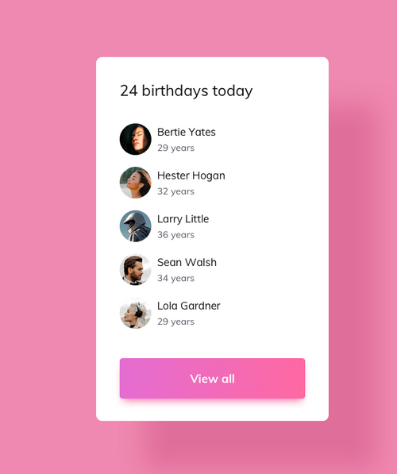

# Activity 2: 

In this activity, you'll follow the steps below to build a webpage as in the screenshot:



---

## Part 1/3

1. **Download and Extract Starter Files:**
   - Download the `starter.zip` file provided.
   - Extract the contents of the zip file to a directory on your computer.

2. **Open Visual Studio Code (VSCode):**
   - Navigate to the extracted folder containing the starter files.
   - Open Visual Studio Code (VSCode)
   - In VSCode, locate and open the `styles1.css` file found within the starter folder.
   - Review the contents of `styles1.css`. It should initially be empty.

3. **Add CSS Rules:**
   - Inside `styles1.css`, add the following CSS rules:
    ```css
    *,:after,:before {
        margin: 0;
        padding: 0;
        box-sizing: border-box
    }

    html {
        font-size: 100%
    }

    :root {
        --primary-100: #fae8ff;
        --primary-200: #f5d0fe;
        --primary-300: #f0abfc;
        --primary-400: #e879f9;
        --primary-500: #d946ef;
        --primary-600: #c026d3;
        --primary-700: #a21caf;
        --primary-800: #86198f;
        --primary-900: #701a75;
        --grey-50: #f8fafc;
        --grey-100: #f1f5f9;
        --grey-200: #e2e8f0;
        --grey-300: #cbd5e1;
        --grey-400: #94a3b8;
        --grey-500: #64748b;
        --grey-600: #475569;
        --grey-700: #334155;
        --grey-800: #1e293b;
        --grey-900: #0f172a;
        --black: #222;
        --white: #fff;
        --red-light: #f8d7da;
        --red-dark: #842029;
        --green-light: #d1e7dd;
        --green-dark: #0f5132;
        --small-text: .875rem;
        --extra-small-text: .7em;
        --backgroundColor: var(--grey-50);
        --textColor: var(--grey-900);
        --borderRadius: .25rem;
        --letterSpacing: 1px;
        --transition: .3s ease-in-out all;
        --max-width: 1120px;
        --fixed-width: 600px;
        --shadow-1: 0 1px 3px 0 rgba(0, 0, 0, .1), 0 1px 2px 0 rgba(0, 0, 0, .06);
        --shadow-2: 0 4px 6px -1px rgba(0, 0, 0, .1), 0 2px 4px -1px rgba(0, 0, 0, .06);
        --shadow-3: 0 10px 15px -3px rgba(0, 0, 0, .1), 0 4px 6px -2px rgba(0, 0, 0, .05);
        --shadow-4: 0 20px 25px -5px rgba(0, 0, 0, .1), 0 10px 10px -5px rgba(0, 0, 0, .04)
    }

    body {
        background: var(--backgroundColor);
        font-family: system-ui,-apple-system,BlinkMacSystemFont,Segoe UI,Roboto,Oxygen,Ubuntu,Cantarell,Open Sans,Helvetica Neue,sans-serif;
        font-weight: 400;
        line-height: 1;
        color: var(--textColor)
    }
    ```
   - Discuss the purpose of each CSS rule

4. **Add CSS Rules:**
   - Inside `styles1.css`, add the following CSS rules:
    ```css
    p {
        margin: 0
    }

    h1,h2,h3,h4,h5 {
        margin: 0;
        font-family: var(--headingFont);
        font-weight: 400;
        line-height: 1;
        text-transform: capitalize;
        letter-spacing: var(--letterSpacing)
    }

    h1 {
        font-size: 3.052rem
    }

    h2 {
        font-size: 2.441rem
    }

    h3 {
        font-size: 1.953rem
    }

    h4 {
        font-size: 1.563rem
    }

    h5 {
        font-size: 1.25rem
    }

    .text {
        margin-bottom: 1.5rem;
        max-width: 40em
    }

    small,.text-small {
        font-size: var(--small-text)
    }

    a {
        text-decoration: none
    }

    ul {
        list-style-type: none;
        padding: 0
    }

    .img {
        width: 100%;
        display: block;
        object-fit: cover
    }

    .btn {
        cursor: pointer;
        color: var(--white);
        background: var(--primary-500);
        border: transparent;
        border-radius: var(--borderRadius);
        letter-spacing: var(--letterSpacing);
        padding: .375rem .75rem;
        box-shadow: var(--shadow-1);
        transition: var(--transition);
        text-transform: capitalize;
        display: inline-block
    }

    .btn:hover {
        background: var(--primary-700);
        box-shadow: var(--shadow-3)
    }

    .btn-hipster {
        color: var(--primary-500);
        background: var(--primary-200)
    }

    .btn-hipster:hover {
        color: var(--primary-200);
        background: var(--primary-700)
    }

    .btn-block {
        width: 100%
    }

    .alert {
        padding: .375rem .75rem;
        margin-bottom: 1rem;
        border-color: transparent;
        border-radius: var(--borderRadius)
    }

    .alert-danger {
        color: var(--red-dark);
        background: var(--red-light)
    }

    .alert-success {
        color: var(--green-dark);
        background: var(--green-light)
    }

    .form {
        width: 90vw;
        max-width: var(--fixed-width);
        background: var(--white);
        border-radius: var(--borderRadius);
        box-shadow: var(--shadow-2);
        padding: 2rem 2.5rem;
        margin: 3rem auto
    }

    .form-label {
        display: block;
        font-size: var(--small-text);
        margin-bottom: .5rem;
        text-transform: capitalize;
        letter-spacing: var(--letterSpacing)
    }

    .form-input,.form-textarea {
        width: 100%;
        padding: .375rem .75rem;
        border-radius: var(--borderRadius);
        background: var(--backgroundColor);
        border: 1px solid var(--grey-200)
    }

    .form-row {
        margin-bottom: 1rem
    }

    .form-textarea {
        height: 7rem
    }

    ::placeholder {
        font-family: inherit;
        color: var(--grey-400)
    }

    .form-alert {
        color: var(--red-dark);
        letter-spacing: var(--letterSpacing);
        text-transform: capitalize
    }

    @keyframes spinner {
        to {
            transform: rotate(360deg)
        }
    }

    .loading {
        width: 6rem;
        height: 6rem;
        border: 5px solid var(--grey-400);
        border-radius: 50%;
        border-top-color: var(--primary-500);
        animation: spinner .6s linear infinite;
        margin: 0 auto
    }

    .title {
        text-align: center
    }

    .title-underline {
        background: var(--primary-500);
        width: 7rem;
        height: .25rem;
        margin: 0 auto;
        margin-top: 1rem
    }

    body {
        background: var(--primary-100)
    }

    main {
        min-height: 100vh;
        display: flex;
        justify-content: center;
        align-items: center
    }

    .container {
        width: 90vw;
        margin: 5rem 0;
        max-width: var(--fixed-width);
        background: var(--white);
        border-radius: var(--borderRadius);
        padding: 1.5rem 2rem;
        box-shadow: var(--shadow-1)
    }

    .container h3 {
        margin-bottom: 2rem
    }

    .person img {
        width: 75px;
        height: 75px;
        border-radius: 50%;
        box-shadow: var(--shadow-3)
    }

    .person {
        display: grid;
        grid-template-columns: auto 1fr;
        column-gap: .75rem;
        margin-bottom: 1.5rem;
        align-items: center
    }

    .person h4 {
        font-weight: 500;
        margin-bottom: .5rem
    }

    p {
        color: var(--grey-500)
    }
    ```
   - Discuss the purpose of each CSS rule

5. **View Changes in Browser:**
   - Save the changes made to both `styles1.css` and `index1.html`.
   - Open `index1.html` in a web browser to view the applied CSS styling.

---

## Part 2/3

1. **Open Visual Studio Code (VSCode):**
   - In VSCode, locate and open the `styles2.css` file found within the starter folder.
   - Review the contents of `styles2.css`. It should initially be empty.

2. **Add CSS Rules:**
   - Inside `styles2.css`, add the following CSS rules:
    ```css
    *,
    :after,
    :before {
    margin: 0;
    padding: 0;
    box-sizing: border-box;
    }
    html {
    font-size: 100%;
    }
    :root {
    --primary-100: #d1fae5;
    --primary-200: #a7f3d0;
    --primary-300: #6ee7b7;
    --primary-400: #34d399;
    --primary-500: #10b981;
    --primary-600: #059669;
    --primary-700: #047857;
    --primary-800: #065f46;
    --primary-900: #064e3b;
    --grey-50: #f8fafc;
    --grey-100: #f1f5f9;
    --grey-200: #e2e8f0;
    --grey-300: #cbd5e1;
    --grey-400: #94a3b8;
    --grey-500: #64748b;
    --grey-600: #475569;
    --grey-700: #334155;
    --grey-800: #1e293b;
    --grey-900: #0f172a;
    --black: #222;
    --white: #fff;
    --red-light: #f8d7da;
    --red-dark: #842029;
    --green-light: #d1e7dd;
    --green-dark: #0f5132;
    --small-text: 0.875rem;
    --extra-small-text: 0.7em;
    --backgroundColor: var(--grey-50);
    --textColor: var(--grey-900);
    --borderRadius: 0.25rem;
    --letterSpacing: 1px;
    --transition: 0.3s ease-in-out all;
    --max-width: 1120px;
    --fixed-width: 600px;
    --shadow-1: 0 1px 3px 0 rgba(0, 0, 0, 0.1), 0 1px 2px 0 rgba(0, 0, 0, 0.06);
    --shadow-2: 0 4px 6px -1px rgba(0, 0, 0, 0.1),
        0 2px 4px -1px rgba(0, 0, 0, 0.06);
    --shadow-3: 0 10px 15px -3px rgba(0, 0, 0, 0.1),
        0 4px 6px -2px rgba(0, 0, 0, 0.05);
    --shadow-4: 0 20px 25px -5px rgba(0, 0, 0, 0.1),
        0 10px 10px -5px rgba(0, 0, 0, 0.04);
    }
    body {
    background: var(--backgroundColor);
    font-family: system-ui, -apple-system, BlinkMacSystemFont, Segoe UI, Roboto,
        Oxygen, Ubuntu, Cantarell, Open Sans, Helvetica Neue, sans-serif;
    font-weight: 400;
    line-height: 1;
    color: var(--textColor);
    }
    p {
    margin: 0;
    }
    h1,
    h2,
    h3,
    h4,
    h5 {
    margin: 0;
    font-family: var(--headingFont);
    font-weight: 400;
    line-height: 1;
    text-transform: capitalize;
    letter-spacing: var(--letterSpacing);
    }
    h1 {
    font-size: 3.052rem;
    }
    h2 {
    font-size: 2.441rem;
    }
    h3 {
    font-size: 1.953rem;
    }
    h4 {
    font-size: 1.563rem;
    }
    h5 {
    font-size: 1.25rem;
    }
    .text {
    margin-bottom: 1.5rem;
    max-width: 40em;
    }
    small,
    .text-small {
    font-size: var(--small-text);
    }
    a {
    text-decoration: none;
    }
    ul {
    list-style-type: none;
    padding: 0;
    }
    .img {
    width: 100%;
    display: block;
    object-fit: cover;
    }
    .btn {
    cursor: pointer;
    color: var(--white);
    background: var(--primary-500);
    border: transparent;
    border-radius: var(--borderRadius);
    letter-spacing: var(--letterSpacing);
    padding: 0.375rem 0.75rem;
    box-shadow: var(--shadow-1);
    transition: var(--transition);
    text-transform: capitalize;
    display: inline-block;
    }
    .btn:hover {
    background: var(--primary-700);
    box-shadow: var(--shadow-3);
    }
    .btn-hipster {
    color: var(--primary-500);
    background: var(--primary-200);
    }
    .btn-hipster:hover {
    color: var(--primary-200);
    background: var(--primary-700);
    }
    .btn-block {
    width: 100%;
    }
    .alert {
    padding: 0.375rem 0.75rem;
    margin-bottom: 1rem;
    border-color: transparent;
    border-radius: var(--borderRadius);
    }
    .alert-danger {
    color: var(--red-dark);
    background: var(--red-light);
    }
    .alert-success {
    color: var(--green-dark);
    background: var(--green-light);
    }
    .form {
    width: 90vw;
    max-width: var(--fixed-width);
    background: var(--white);
    border-radius: var(--borderRadius);
    box-shadow: var(--shadow-2);
    padding: 2rem 2.5rem;
    margin: 3rem auto;
    }
    .form-label {
    display: block;
    font-size: var(--small-text);
    margin-bottom: 0.5rem;
    text-transform: capitalize;
    letter-spacing: var(--letterSpacing);
    }
    .form-input,
    .form-textarea {
    width: 100%;
    padding: 0.375rem 0.75rem;
    border-radius: var(--borderRadius);
    background: var(--backgroundColor);
    border: 1px solid var(--grey-200);
    }
    .form-row {
    margin-bottom: 1rem;
    }
    .form-textarea {
    height: 7rem;
    }
    ::placeholder {
    font-family: inherit;
    color: var(--grey-400);
    }
    .form-alert {
    color: var(--red-dark);
    letter-spacing: var(--letterSpacing);
    text-transform: capitalize;
    }
    @keyframes spinner {
    to {
        transform: rotate(360deg);
    }
    }
    .loading {
    width: 6rem;
    height: 6rem;
    border: 5px solid var(--grey-400);
    border-radius: 50%;
    border-top-color: var(--primary-500);
    animation: spinner 0.6s linear infinite;
    margin: 0 auto;
    }
    ```
   - Discuss the purpose of each CSS rule

3. **Add CSS Rules:**
   - Inside `styles2.css`, add the following CSS rules:
    ```css
    .title {
    text-align: center;
    }
    .title-underline {
    background: var(--primary-500);
    width: 7rem;
    height: 0.25rem;
    margin: 0 auto;
    margin-top: 1rem;
    }
    main {
    width: 90vw;
    max-width: var(--max-width);
    margin: 5rem auto;
    }
    .tours {
    padding: 2rem 0;
    display: grid;
    gap: 2rem;
    }
    .single-tour {
    background: var(--white);
    border-radius: var(--borderRadius);
    box-shadow: var(--shadow-1);
    transition: var(--transition);
    position: relative;
    }
    .single-tour:hover {
    box-shadow: var(--shadow-3);
    }
    .single-tour .img {
    height: 20rem;
    border-top-right-radius: var(--borderRadius);
    border-top-left-radius: var(--borderRadius);
    }
    .tour-price {
    position: absolute;
    top: 0;
    right: 0;
    padding: 0.5rem;
    color: var(--white);
    letter-spacing: 2px;
    background: var(--primary-500);
    border-top-right-radius: var(--borderRadius);
    }
    .tour-info {
    padding: 2rem 1.5rem;
    }
    .tour-info h5 {
    text-align: center;
    margin-bottom: 1rem;
    font-weight: 500;
    line-height: 1.5;
    }
    .tour-info p {
    line-height: 1.5;
    color: var(--grey-500);
    margin-bottom: 1.25rem;
    }
    .info-btn,
    .delete-btn {
    background: transparent;
    border: transparent;
    text-transform: capitalize;
    cursor: pointer;
    }
    .info-btn {
    color: var(--primary-500);
    font-weight: 600;
    }
    .delete-btn {
    border: 1px solid var(--primary-500);
    color: var(--primary-500);
    }
    .delete-btn:hover {
    background: var(--primary-500);
    color: var(--white);
    }
    @media screen and (min-width: 768px) {
    .tours {
        grid-template-columns: 1fr 1fr;
        align-items: start;
    }
    }
    @media screen and (min-width: 992px) {
    .tours {
        grid-template-columns: 1fr 1fr 1fr;
        align-items: start;
    }
    }
    ```
   - Discuss the purpose of each CSS rule
   
4. **View Changes in Browser:**
   - Save the changes made to both `styles2.css` and `index2.html`.
   - Open `index2.html` in a web browser to view the applied CSS styling.

----

## Part 3/3: Push to GitHub

- Local Git Repository
  - Make the project directory a Git repository by running:
    ```bash
    git init
    ```
   - Create a `.gitignore` file to exclude `node_modules`  file from version control:

    ```
    node_modules/
    ```
  - Stage all the changes:

    ```bash
    git add .
    ```
  - Commit the changes:
    ```bash
    git commit -m  "meaningful message"
    ```

- Push to GitHub
  - Create a new repository on GitHub
  - Link your local repository to the GitHub repository:
    ```bash
    git remote add origin <GitHub Repository URL>
    ```
  - Push your local repository to GitHub:
    ```bash
    git push -u origin main


## Ref

- https://www.uidesigndaily.com/posts/sketch-birthdays-list-card-widget-day-1042
- https://github.com/john-smilga/react-projects/tree/master/01-birthday-reminder
